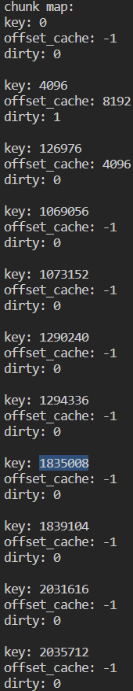
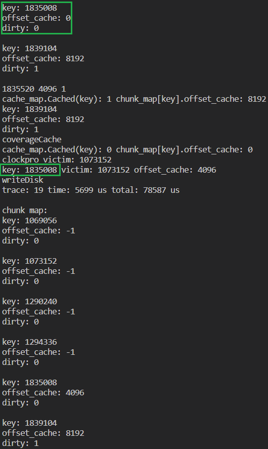

##### 2023.10.26
问题：

Trace：mojitianqi，CACHE_SIZE：3

offset_cache=-1导致调用read/writeCache函数时文件读写报错
分析：

- 已排除odirectread/write的问题

- 检查代码，发现在CACHE_SIZE=3且cache已满的情况下，理论上chunk_map应该显示有3个offset_cache非-1的chunk，但是现在却不是这样，见下图。此时victim为key=1835008的chunk（下称[1835008]），但是它的offset_cache却为-1。由此，推断它的offset_cache没有正确赋值。

  

- 向前寻找[1835008]上一次offset_cache不为0的时刻，是trace20访问完
- 同时寻找第一次cache满且出现少于CACHE_SIZE个chunk的offset_cache不为-1的时刻，是trace19访问完



- 观察可得，trace18时，[1835008]还在缓存中，trace19访问它时却认定其不在缓存中，将[1073152]的位置替换成了[1835008]，[1073152]则遗憾退场，这是为什么呢？

- 由于LRU运行时未出现类似错误，则暂时认为是Clockpro::cache_map.Cached函数出错，尝试把第二条判断注释，如下。结果，trace18就报错。

  ```c
  // --clockpro.hpp--
  bool Cached(const k& key){
  	if (cache_map.find(key) == cache_map.end()) return false;
  	// if (cache_map[key]->ptype == ptTest) return false;
  	return true;
  }
  ```

- 发现clockpro.hpp第182行（此处第10行）有一条注释的代码，检查一下源码是否注释，源码地址为https://github.com/maximecaron/ClockProCPP

  ```c
  // --clockpro.hpp--
  bool Set(k key, v value)
  {
  	if(cache_map.find(key) == cache_map.end()) // miss
  	{
  		// Allocate memory outside of holding cache the lock
  		auto e = new Entry<k, v>(false, key, value, ptCold);
  		// no cache entry?  add it
  		cache_map[key]=e;
  		// cache_map.insert_or_assign(key, e);
  		std::unique_lock<std::mutex> lockx(cacheMutex);
  		meta_add(e);
  		count_cold++;
  		return true;
  	}
  ......
  }
  ```

  81920 cnt==0

  